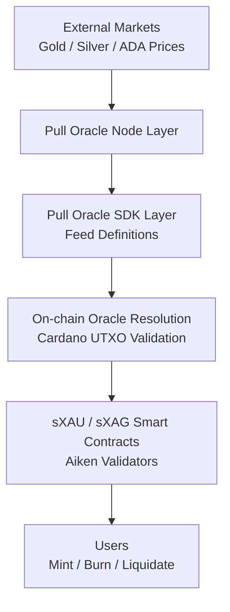

# sXAU + sXAG Pull-Oracle Synthetic Commodities Protocol

A Cardano-native synthetic asset protocol enabling real-time minting and trading of:

- 🪙 sXAU (synthetic gold)
- 🪙 sXAG (synthetic silver)

Powered by a **custom pull-oracle network** using Charli3 pull-oracle infrastructure.

---

# Overview

This system enables users to:

- Deposit ADA as collateral
- Mint synthetic exposure to gold and silver
- Use real-time oracle pricing via pull-oracle execution
- Burn assets to redeem collateral
- Participate in liquidation markets

---

# System Architecture

## High-Level Flow



XAU/ADA = (XAU/USD) ÷ (ADA/USD)
XAG/ADA = (XAG/USD) ÷ (ADA/USD)


## 🌊 Operational Flows

### 1. Minting Exposure
Users lock ADA collateral to mint synthetic gold or silver. The oracle price determines the maximum mintable amount.


### 2. Burning & Redemption
Burning synthetic assets unlocks the underlying ADA collateral. No "loan" to repay, just a redemption of value.


### 3. Oracle Infrastructure
Powered by **Charli3 Pull-Oracles** for real-time, low-latency price feeds directly on-chain.


---

## 🛠 System Architecture


```
project-root/
│
├── oracle-sdk/
│   ├── feeds/
│   │   ├── xau_usd.yaml
│   │   ├── xag_usd.yaml
│   │   └── ada_usd.yaml
│
├── oracle-node/
│   ├── adapters/
│   │   ├── gold.ts
│   │   ├── silver.ts
│   │   └── ada.ts
│   └── index.ts
│
├── contracts/ (Aiken)
│   ├── vault.ak
│   ├── oracle_validator.ak
│   ├── mint.ak
│   └── lib/
│
├── app/
│   ├── mint.ts
│   ├── burn.ts
│   └── liquidate.ts
│
└── docs/
```

## Collateral?

Even without "borrowing," collateral is essential to:
- **Prevent Infinite Minting**: Ensures every sXAU is backed by real value.
- **Maintain Peg Stability**: Institutional confidence depends on transparent backing.
- **Enable Solvency**: Over-collateralization protects the protocol during volatility.
